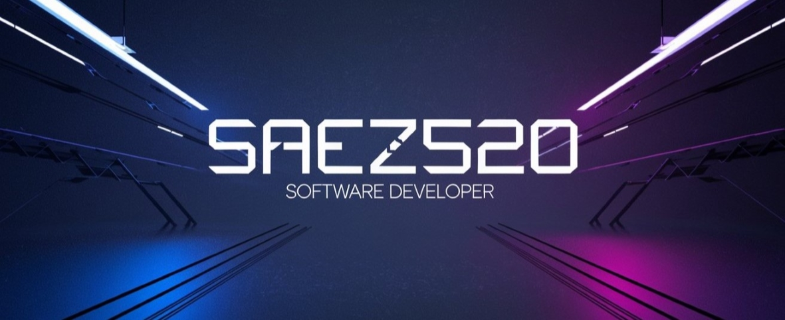

# Hi there! 👋 I'm Saez520

  <h1>🚀 Full Stack Developer</h1>
  

    I have almost 3 years of experience working with Java and Spring Boot, along with a strong focus on backend development with Express and TypeScript. 
    I also have experience working on the frontend, handling technologies such as React, Next.js and Tailwind CSS. 
    I am passionate about creating robust and efficient applications, both server-side and frontend.  
    I am always looking for new ways to improve my skills and contribute to projects that have a positive impact.
  

---

  <h2>🛠️ Tech Stack</h2>

- **Languages:** Java, JavaScript, TypeScript, SQL, MongoDB
- **Frameworks & Libraries:** Spring Boot, Express, React, Next.js, Tailwind CSS
- **Tools & Platforms:** Git, Docker, AWS, Node.js, serverless

---

  <h2>🌱 Currently learning:</h2>

- Cloud infrastructure and DevOps practices
- Microservices architecture

---

<!--

  <h2>✨ Projects</h2>

Here are some of the projects I'm proud of:
- **Project 1:** _Short description with a link to the repo_ 
- **Project 2:** _Another description with a link_

---
-->

  <h2>💬 Let's Connect:</h2>

- **LinkedIn:** [My LinkedIn](https://www.linkedin.com/in/juan-saez-482a81236)
- **Email:** [Juan Saez](mailto:juansaezpg@gmail.com)
- **Twitter:** [SaezM520](https://twitter.com/saezm520)

<!--
**Saez520/Saez520** is a ✨ _special_ ✨ repository because its `README.md` (this file) appears on your GitHub profile.

Here are some ideas to get you started:

- 🔭 I’m currently working on ...
- 🌱 I’m currently learning ...
- 👯 I’m looking to collaborate on ...
- 🤔 I’m looking for help with ...
- 💬 Ask me about ...
- 📫 How to reach me: ...
- 😄 Pronouns: ...
- ⚡ Fun fact: ...
-->
