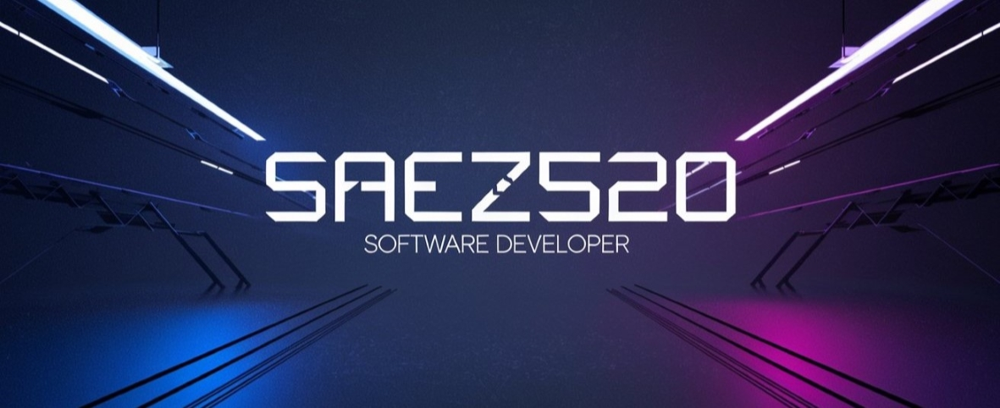

# Hi there! 👋 I'm Saez520

  <h1>🚀 Tech Lead & Software Developer</h1>
  

    Tech Lead with 4+ years of experience building and leading high-performance web applications
    for the mobility and public transport sector. Currently leading a team at Quipux,
    architecting a monolith-to-microservices migration deployed across Colombia, Brazil, Ecuador,
    and Ivory Coast.

    Passionate about AI systems engineering — I design multi-agent orchestration architectures
    and internal AI workflows that reduce development time and token consumption at scale.
  

---

  <h2>🛠️ Tech Stack</h2>

- **Languages:** Java, JavaScript, TypeScript, SQL, Python
- **Frameworks & Libraries:** Spring Boot, JPA/Hibernate, Angular, React, Next.js, Express
- **AI Tooling:** Claude Code, OpenCode, GitHub Copilot, LLM agent orchestration
- **Tools & Platforms:** Git, PostgreSQL, Node.js, Docker

---

  <h2>📊 Skill Levels</h2>

### Languages
- **Java**  
  
- **JavaScript**  
  
- **TypeScript**  
  
- **SQL**  
  
- **Python**  
  

### Frameworks & Libraries
- **Spring Boot**  
  
- **Angular**  
  
- **Express**  
  
- **React**  
  
- **Next.js**  
  

---

  <h2>🤖 Featured AI Project</h2>

### FlowTask — Multi-Agent Development Orchestration System
AI-driven workflow system that coordinates specialized agents (planner, constructor,
validator, inspector) to automate end-to-end software development tasks. Currently in
post-development maintenance and iteration.

**Key result:** 91% reduction in context token consumption per operation
(from ~2,200 to ~180 tokens) via LSP + AST-Grep semantic isolation.

→ [View repository](https://github.com/Saez520/flowtask)

---

  <h2>💬 Let's Connect:</h2>

- **LinkedIn:** [My LinkedIn](https://www.linkedin.com/in/juan-saez-482a81236)
- **Email:** [Juan Saez](mailto:juansaezpg@gmail.com)
- **Twitter:** [SaezM520](https://twitter.com/saezm520)
